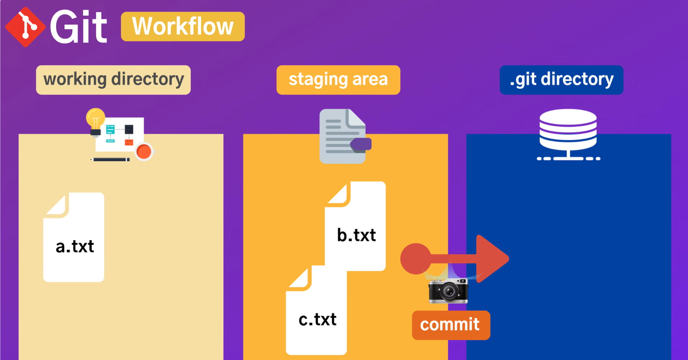
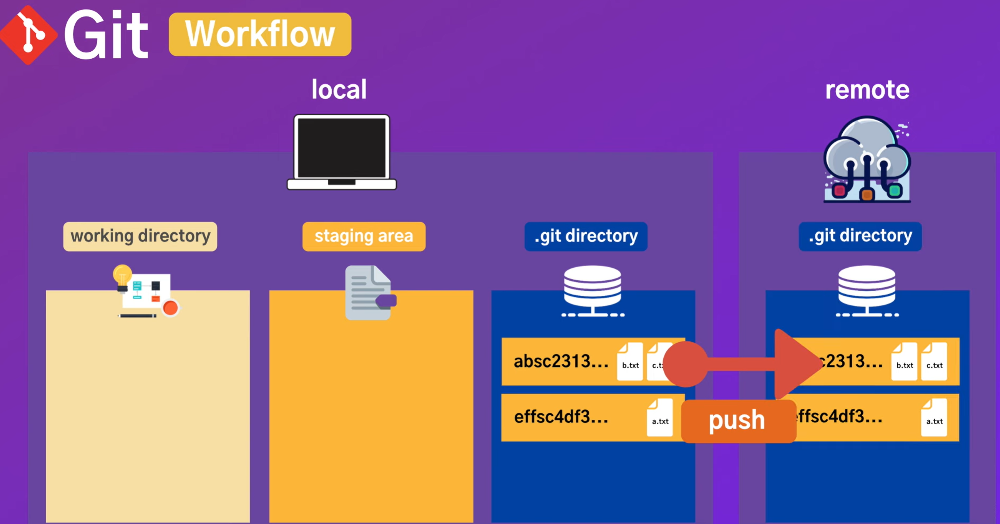
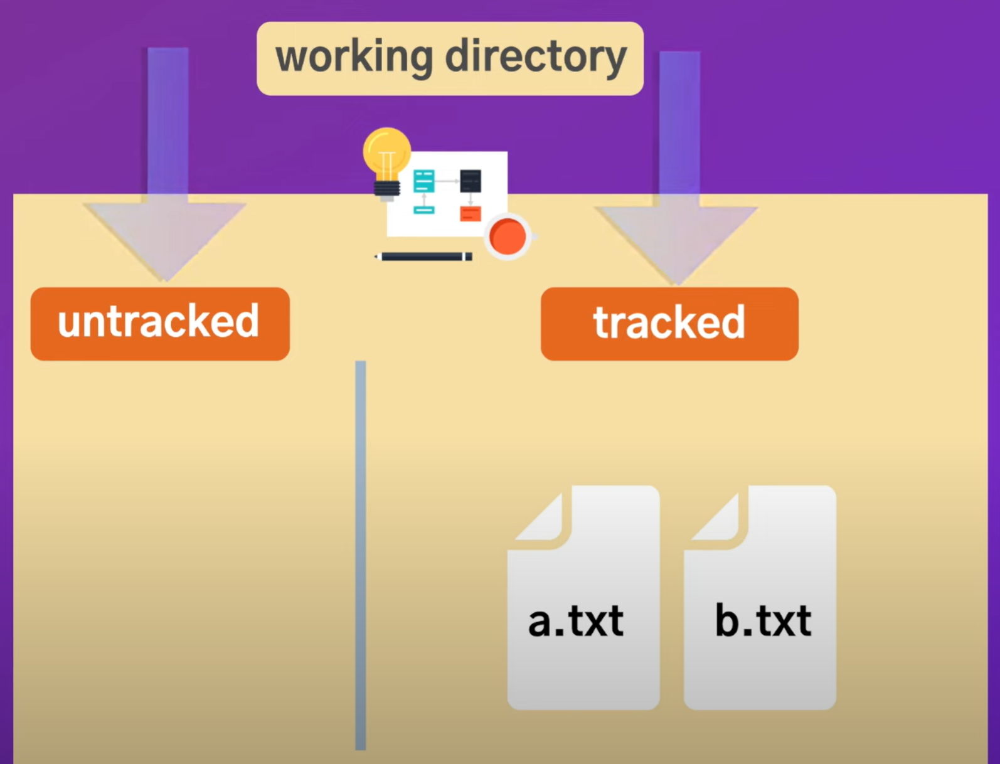
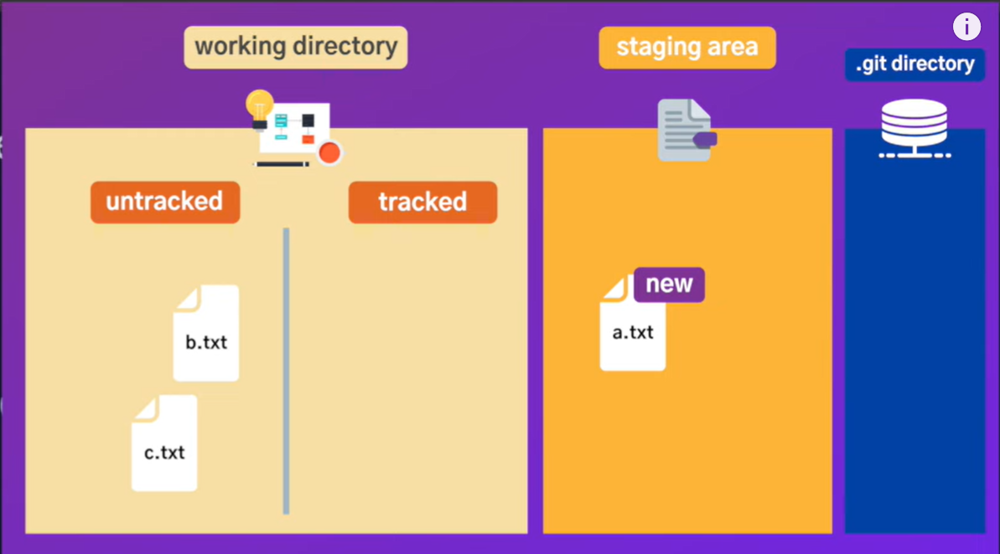
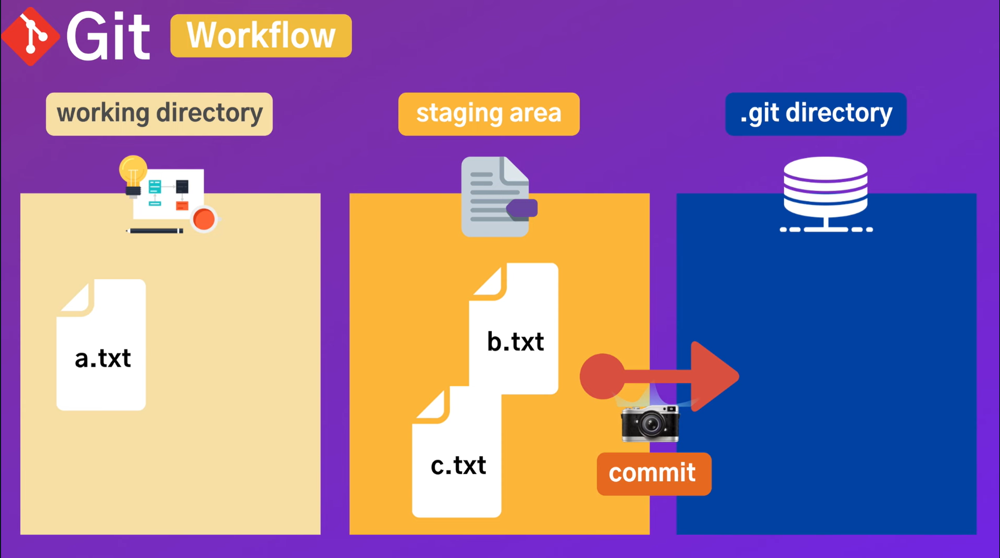
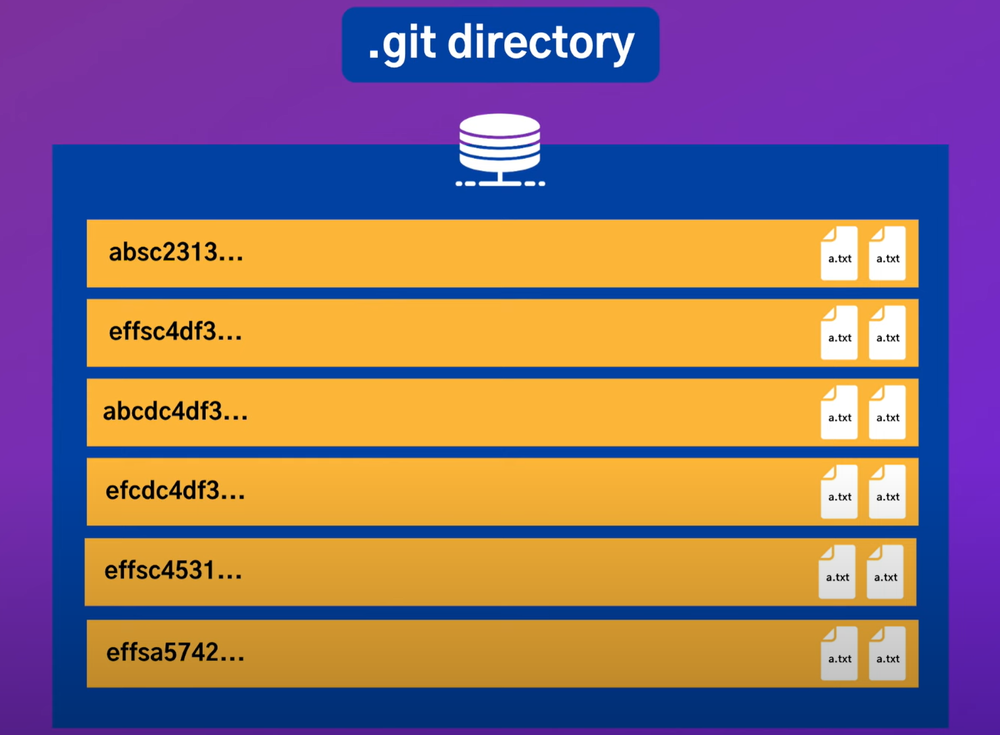
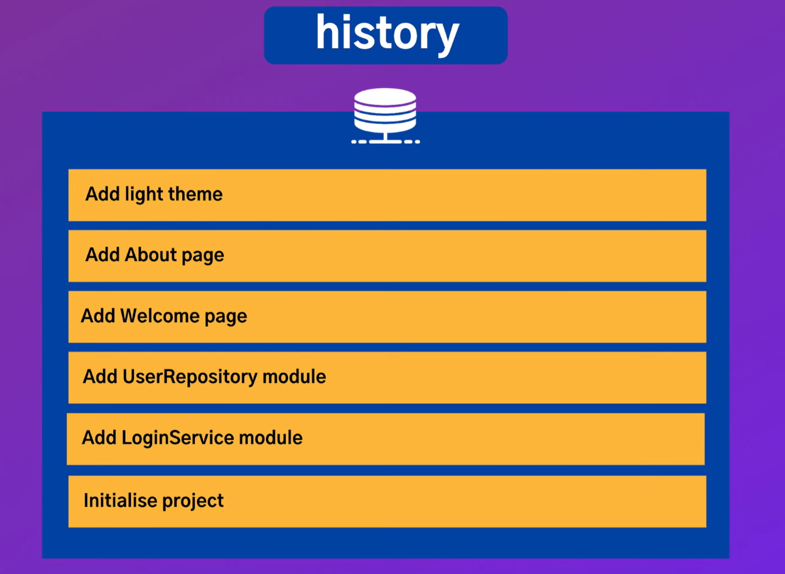

# git 처음 설정 해야 될 것
Cmder에서 실행

```
git --version
```
- 깃 설치 유무  
ex) git version 2.50.1.windows.1
<br><br>

```
git config --list
```
- 모든 설정 확인 가능 
<br><br>

```
git config --gobal -e
```
- 전역 Git 설정 파일을 편집기에서 열어 수정
<br><br>

```
code .
```
- 터미널에서 VS code 열기
<br><br>

```
git config --global core.editor "code"
```
- git의 기본 텍스트 편집기를 VS로 설정
<br><br>

```
git config --global user.name"전석민"
git config --global user.email"okeyduky@naver.com"
```
- user 이름, 이메일 설정
<br><br>

```
git config user.name
git config user.email
```
- user 이름, 이메일 확인
<br><br>

```
git config --global core.autocrlf true # mac이라면 true 대신 input
```
- 운영체제마다 에디터에서 새로운 줄바꿈을 할 때 들어가는 문자열이 달라지는데, git history 등을 볼 때 문제점이 생기는 것을 방지. (core.autocrlf)
<br><br><br>

## 깃 초기화/삭제 하기

```
cd projects
mkdir git
cd git
ls -al
```
- cd projects
  - (Change Directory) 현재 경로에서 projects라는 디렉토리(폴더)로 들어감
- mkdir git
  - (Make Directory) git이라는 새 폴더를 생성
- ls -al
  - ls: 현재 디렉토리의 내용을 나열(list)하는 명령
  - -a : 숨김 파일까지 표시 (예: .git)
  - -l : log format, 즉 자세한 정보까지 보여줌 (권한, 소유자, 그룹, 크기, 날짜 등)

실행결과:  
```
$ ls -al
total 0  
drwxr-xr-x 1 smlab 197611 0 Jul 18 12:00 ./  
drwxr-xr-x 1 smlab 197611 0 Jul 18 12:00 ../
```
<br><br>

```
git init
```
- git 초기화

실행결과:
```
Initialized empty Git repository in C:/Users/smlab/project/git/.git/
```

git 초기화 후 `ls -al` 명령을 실행시켜보면 (내용을 확인해보면)
```
total 4
drwxr-xr-x 1 smlab 197611 0 Jul 18 12:06 ./
drwxr-xr-x 1 smlab 197611 0 Jul 18 12:00 ../
drwxr-xr-x 1 smlab 197611 0 Jul 18 12:06 .git/
```
폴더, 파일명 안에 '.'이 있으면 숨겨진 파일이라는 뜻

```
ls
explorer .git
```
- 숨겨진 .git폴더를 열어서 확인, git에 관련된 모든 정보들이 저장됨

```
rm -rf .git
```
- .git 삭제

```
git config --global alis.st status
git st # git status
```
- 명령어를 줄여서 사용할수 있게함

```
git config --h
```

- 다양한 속성값들 확인
<br><br>

## GIT BASIC





#### Working directory는 **Untracked** 와 **tracked** 로 나눌 수 있음  
- tracked :tracking 하고 있는 file
  - 수정이 되었는지 유무에 따라 unmodified, modified
  - modified 파일만 staging area로 옮겨질 수 있음.
- untracked :새로 만들어진 파일, 기존에 존재하던 파일에서 깃을 초기화할 때, 파일에 대한 정보 x

<br>

```
echo hello world! > a.txt
```
- echo : 터미널에서 문자열을 출력할 때 사용하는 명령어
- \> : 출력된 결과를 파일로 리디렉션(저장)
- a.txt : 저장할 파일 이름
<br><br>

```
git status
```
<br>

실행 결과:
```
On branch master
No commits yet
```
- 현재 master branch에 있음
- 아직 한 번도 커밋하지 않은 상태 (No commits yet)

<br>

```
Untracked files:
  (use "git add <file>..." to include in what will be committed)
        .anaconda/
        .bash_history
        ...
        a.txt
        ab.txt
        ...
```
- 이 리스트에 있는 파일 및 폴더들은 현재 Git이 버전 관리하고 있지 않은 상태
- 즉, Git은 이 파일들을 모니터링 하고 있지 않으며, 커밋 대상이 아님.
<br><br>

```
nothing added to commit but untracked files present (use "git add" to track)
```
<br>

요약문구
- 지금 커밋 할 것은 없지만(add한 파일 없음)
- 추적되지 않은(untracked) 파일은 많이 있다는 뜻.
<br><br>

### git이 tracking 할 수 있도록 untracked -> staging area로 옮기는 방법
```
git add a.txt
```


#### 혹시 이런 화면과 함께 실행이 되지 않는다면?
```
fatal: Unable to create 'C:/Users/smlab/.git/index.lock': File exists.

Another git process seems to be running in this repository, e.g.
an editor opened by 'git commit'. Please make sure all processes
are terminated then try again. If it still fails, a git process
may have crashed in this repository earlier:
remove the file manually to continue.
```

<br>
원인 : Git은 내부 작업을 할 때 .git/index 파일을 보호하기 위해 index.lock이라는 잠금 파일을 생성하는데, 이전 Git 작업이 비정상적으로 종료되면 이 파일이 삭제되지 않고 남아서 이후 작업을 막는 경우가 있음.  
- 아래 명령어를 통해 잠금 파일을 삭제해야됨.

```
del .git\index.lock
```
<br>

아무튼 `git add a.txt` 명령어를 통해 a.txt를 staging area에 옮기는데 성공했다면
```
git status
```
<br>
실행 결과:

```
Changes to be committed:
  (use "git rm --cached <file>..." to unstage)
        new file:   a.txt
```
- 커밋할 준비가 되어있는 변경사항인 a.txt가 생김.

<br>

```
git add *.txt
```
- .txt로 끝나는 모든 파일들을 추가
- 추가할때 경고창이 뜰 수 있는데
```
warning: in the working copy of 'OneDrive/바탕 화면/cmder_V1.3.25/vendor/git-for-windows/usr/share/v
im/vim91/tutor/README.el.txt', LF will be replaced by CRLF the next time Git touches it
warning: in the working copy of 'OneDrive/바탕 화면/cmder_V1.3.25/vendor/git-for-windows/usr/share/v
im/vim91/tutor/README.ru.utf-8.txt', LF will be replaced by CRLF the next time Git touches it
warning: in the working copy of 'OneDrive/바탕 화면/cmder_V1.3.25/vendor/git-for-windows/usr/share/v
im/vim91/tutor/README.txt', LF will be replaced by CRLF the next time Git touches it
...
```
- "Git이 줄바꿈을 LF → CRLF로 변환할 거예요" 라는 뜻
- 원인 : core.autocrlf=true 설정으로 줄바꿈 변환 예정
- warning은 크게 신경안써도됨.

```
echo ellie >> a.txt
git status
```

를 실행하니까 뭔 빨간색으로 파일 경로들이 좌라라락 엄청 많이 뜨기 시작.  
GPT한테 물어보니
> Git 사용 위치가 적절하지 않아 너무 많은 시스템 파일들이 추적 대상이 되고 있는 상황, 지금 뜨는 빨간 글씨들은 Git이 추적하고 있지 않은(untracked) 파일 또는 폴더들의 경로임.

#### 이렇게 하면 문제가 되는 이유
1. 너무 많은 시스템/개인 폴더가 Git 추적 대상에 들어옴 (불필요하고 위험)
2. .git 폴더가 사용자 홈 디렉토리에 있으면, Git이 홈 전체를 버전관리하려고 함
3. Git 명령어 속도 저하, 실수로 중요한 파일 커밋할 수 있음
<br>

#### 해결 방법: Git 저장소를 전용 폴더에서 따로 구성하자

<br><br>
## Git 저장소 구성


#### 1. 프로젝트 폴더 만들기
  ```
  mkdir myproject
  cd myproject
  ```
  - C:\Users\YourName\Documents\myproject 같은 경로가 됨.
<br>

#### 2. Git 저장소 초기화
` git init `
- git 폴더가 생성되며, 이 폴더부터 Git이 변화를 추적하기 시작함. 
<br>

#### 3. 프로젝트 파일 만들기
```
echo "# My Proeject" > README.md
```
<br>

#### 4. 변경사항 Git에 등록하고 커밋
```
git add.
git commit -m "프로젝트 초기 설정"
```
<br>

#### 5. 원격 저장소(GitHub) 연결
```
git remote add origin https://github.com/Seokmin02/TIL.git
git push -u origin master
```
#### 잘못된 주소를 등록했을때 해결방법
##### 기존 원격 저장소 주소 확인
```
git remote -v
```
<br>

##### 잘못된 원격 저장소 삭제
```
git remote remove origin
```
<br>

#####
올바른 주소로 다시 추가
```
git remote add origin https://github.com/Seokmin02/TIL.git
git push -u origin master

```
<br>

#### 최종 폴더 구조 예시
```
C:\Users\smlab\Documents\myproject
├── .git/        ← Git 저장소 정보
├── README.md
├── main.py      ← (예시) 여러분의 코드 파일
```

문제해결 ㅇㅇ
<br><br>

- 새로운 문자열 ellie를 a.txt 파일에 추가후 ``` git status ``` 실행
```
git ellie >> a.txt
git status
```

<br>
실행결과 : 

```
On branch master  
Your branch is up to date with 'origin/master'.  

Changes to be committed:  
  (use "git restore --staged <file>..." to unstage)  
        new file:   a.txt  
        new file:   b.txt  
        new file:   c.txt  

Changes not staged for commit:  
  (use "git add <file>..." to update what will be committed)  
  (use "git restore <file>..." to discard changes in working directory)  
        modified:   a.txt
```
<br>

 - 총 3개 파일 a.txt, b.txt, c.txt는 커밋할 준비가 되어있는데, 이젠 a라는 파일이 수정되어있는것을 확인할 수 있음.

```
git add a.txt
git status
```

실행결과:
```
C:\Users\smlab\github\myproject (master -> origin)
λ git add a.txt

C:\Users\smlab\github\myproject (master -> origin)
λ git status
On branch master
Your branch is up to date with 'origin/master'.

Changes to be committed:
  (use "git restore --staged <file>..." to unstage)
        new file:   a.txt
        new file:   b.txt
        new file:   c.txt
```
a,b,c가 staging area에 옮겨진 것을 알 수 있음.

#### staging area에서 workging directory로 옮기는 방법
- Staging area에서 제거
```
git rm --cached *
```
실행 결과 : 
```
rm 'README.md'
rm 'a.txt'
rm 'b.txt'
rm 'c.txt'
```
```
git status
```
실행 결과:
```
On branch master
Your branch is up to date with 'origin/master'.

Changes to be committed:
  (use "git restore --staged <file>..." to unstage)
        deleted:    README.md

Untracked files:
  (use "git add <file>..." to include in what will be committed)
        README.md
        a.txt
        b.txt
        c.txt
```
- Untrack 된 상태로 되돌아온것을 확인할 수 있음
<br>

```
git add *
ls
```
실행 결과:
```
a.txt  b.txt  c.txt  README.md
```
<br>

```
git status
```
실행 결과:
```
On branch master
Your branch is up to date with 'origin/master'.

Changes to be committed:
  (use "git restore --staged <file>..." to unstage)
        new file:   a.txt
        new file:   b.txt
        new file:   c.txt
```
- staging area에 옮겨진 것을 확인 할 수 있음
<br><br>

```
rm a.txt
ls
```
실행 결과:
```
b.txt  c.txt  README.md
```
- working directory에는 a.txt 파일이 없는 것을 확인 할 수 있음.

## .gitignore

ex) log로 시작하는 파일들을 추가하고 싶지 않다면
```
echo *.log > .gitignore
ls -al
```

실행 결과:
```
drwxr-xr-x 1 smlab 197611  0  7월 23 10:28 ./
drwxr-xr-x 1 smlab 197611  0  7월 22 20:58 ../
drwxr-xr-x 1 smlab 197611  0  7월 23 10:27 .git/
-rw-r--r-- 1 smlab 197611  8  7월 23 10:28 .gitignore
-rw-r--r-- 1 smlab 197611 15  7월 22 21:14 b.txt
-rw-r--r-- 1 smlab 197611 15  7월 22 21:14 c.txt
-rw-r--r-- 1 smlab 197611 18  7월 22 20:59 README.md
``` 
<br><br>

```
explorer .gitignore
git status
```

실행 결과:
```
On branch master
Your branch is up to date with 'origin/master'.

Changes to be committed:
  (use "git restore --staged <file>..." to unstage)
        new file:   b.txt
        new file:   c.txt

Untracked files:
  (use "git add <file>..." to include in what will be committed)
        .gitignore
```
- 새로 추가된 .gitignore이라는 파일은 있지만 더이상 log 파일은 보이지 않음.
<br><br>

```
log.log
*.log # 모든 로그를 추가하고 싶지 않다.
build/ # 특정 디렉토리 파일 안에 "
build/*.log # 특정 디렉토리 파일 안의 모든 로그 "
``` 
<br>

## git status
<br>

```
git status -h
```

실행 결과:
```
usage: git status [<options>] [--] [<pathspec>...]

    -v, --[no-]verbose    be verbose
    -s, --[no-]short      show status concisely
    -b, --[no-]branch     show branch information
    --[no-]show-stash     show stash information
    --[no-]ahead-behind   compute full ahead/behind values
    --[no-]porcelain[=<version>]
                          machine-readable output
    --[no-]long           show status in long format (default)
    -z, --[no-]null       terminate entries with NUL
    -u, --[no-]untracked-files[=<mode>]
                          show untracked files, optional modes: all, normal, no. (Default: all)
    --[no-]ignored[=<mode>]
                          show ignored files, optional modes: traditional, matching, no. (Default: traditional)
    --[no-]ignore-submodules[=<when>]
                          ignore changes to submodules, optional when: all, dirty, untracked. (Default: all)
    --[no-]column[=<style>]
                          list untracked files in columns
    --no-renames          do not detect renames
    --renames             opposite of --no-renames
    -M, --find-renames[=<n>]
                          detect renames, optionally set similarity index
```
- 모든 옵션들에 대해 확인 가능
<br>

### git status -s
- git status에 대해 간단하게 알고 싶을때 
```
git status -s
```

실행 결과:
```
A  b.txt
A  c.txt
?? .gitignore
```
- A : c라는 파일이 추가가 되었고 staging area에 들어있다.
- ?? : 아직 tracking이 되지 않는 working directory에만 들어있다.
<br><br>

```
echo add >> c.txt
git status - s
```

실행 결과:
```
A  b.txt
AM c.txt
?? .gitignore
```
- AM : staging area에 추가가 되었고 working directory에는 수정(Modified)이 되었다.
<br>

## git diff
- 정확하게 어떤 파일의 내용이 수정되었는지 알고싶을때

```
git diff
```

실행 결과:
```
diff --git a/c.txt b/c.txt
index 12a8798..311c32c 100644
--- a/c.txt        # 이전 버전 파일
+++ b/c.txt        # 현재 수정된 파일
@@ -1 +1,2 @@ 
 hello world!
+add
```
-  "-" : 이전 파일
-  "+" : 새로 변경된 사항 (현재 파일에서 첫번째줄에서 두번째 까지 확인해봐)
<br><br>

```
cat c.txt
```
- 파일 안의 내용 확인
실행결과:
```
hello world!
add
```
- hello world는 staging area에 들어가있고, add는 working directory에 있음.
<br><br>

```
git diff --staged
```
- staging area에 있는것을 확인해보고 싶을 때

실행 결과:
```
λ git diff --staged
diff --git a/b.txt b/b.txt
new file mode 100644
index 0000000..12a8798
--- /dev/null
+++ b/b.txt
@@ -0,0 +1 @@
+hello world!
diff --git a/c.txt b/c.txt
new file mode 100644
index 0000000..12a8798
--- /dev/null
+++ b/c.txt
@@ -0,0 +1 @@
+hello world!
```
<br><br>

### VS CODE와 연결하기
```
git config --global -e
```
실행 후 VS Code가 열림
<br><br>

```
[diff]
  tool = vscode
[difftool "vscode"]
  cmd = code --wait --diff $LOCAL $REMOTE
```
코드 추가 후 저장
<br><br>

```
git difftool
```
- VS code에서 실행 가능
- 왼쪽화면 : 이전버전, 오른쪽화면 : 현재 수정된 파일
<br><br>

## git commit
```
git commit
```
- staging area에 있는 변경 사항을 git repository에 옮겨주는 역할을 함
- 기본 형식
<br><br>

```
Title

Description
```
저장 후 닫아보면
```
[master 9121597] Title      # 해쉬 코드 / Title
 2 files changed, 2 insertions(+)         # 2개 파일 변경, 2개 처음 만들어진파일
 create mode 100644 b.txt
 create mode 100644 c.txt
```
<br>

### git log
```
git log
```
- History 확인
<br><br>

실행결과:
```
commit 91215970ebd2fad804faeab8186629409f177768 (HEAD -> master)
Author: 전석민 <okeyduky@naver.com>
Date:   Wed Jul 23 11:43:42 2025 +0900

    Title

    Description

commit 64e0d02a89006f11019bf3711a03e46f7953c5f1 (origin/master)
Author: 전석민 <okeyduky@naver.com>
Date:   Tue Jul 22 20:59:37 2025 +0900

    프로젝트 초기 설정
```
<br><br>

## commit 하기
```
echo add >> c.txt
git status -s
```
<br>

실행 결과:
```
A  .gitignore
MM c.txt
A  style.css
```
<br><br>

```
git add .         # 전부 추가
git commit -m "second commit"
````
실행 결과:
```
[master 9edf526] second commit
 3 files changed, 5 insertions(+)
 create mode 100644 .gitignore
 create mode 100644 style.css
```
<br><br>

```
git log
```
<br>

실행결과:
```
commit 9edf5269505d212aaf5cfabd5779524001e05c79 (HEAD -> master)
Author: 전석민 <okeyduky@naver.com>
Date:   Wed Jul 23 11:49:11 2025 +0900

    second commit
```
- 두번째 커밋이 실행된것을 확인 가능

```
echo add >> c.txt
git commit -am "third commit"
```
- -am : staging area와 working directory에 있는 모든 파일들을 메세지와 함께 커밋

실행 결과:
```
λ git commit -am "third commit"
[master e7dbf4b] third commit
 1 file changed, 1 insertion(+)
```



git repository에는 어떤 규모의 커밋을 해나가는것이 적당한가?
- git directory의 commit들은 histroy의 창고
- 우리의 작업들을 버전별로 관리할 수 있음
- 전체 어플리케이션으로 만들어서 하나의 커밋으로 관리하면 의미 X
- 기능별로 작은 단위로 만드는것이 중요


- 작은 단위와 모듈별로 나누고 의미있는 이름으로 저장하는것이 좋음.
- 해당 메세지에 맞는 내용만 커밋하는것이 중요