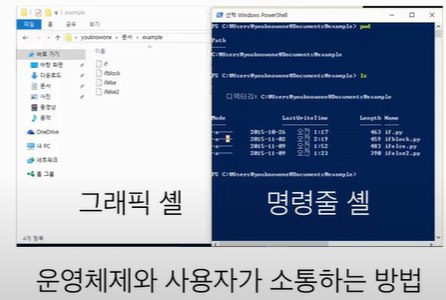

# 숫자와 문자열

###  나누기 /
   - divide = 30 / 5
  
### 나머지 %
   - remainder = 15 % 4
   - 15를 4로 나눈 다음의 나머지 = 3
  
  

# REPL 
- Powershell에서 파일 이름 없이 python이라고만 입력하면 나오는 창
- 파이썬 코드를 한 줄씩 입력해 가면서 테스트 해 볼 수 있는 입력창
- REPL 창을 종료하려면 exit() 라고 입력

  

# Shell 사용법

### Shell 명령어
- pwd  (print working directory): 현재 폴더 경로 출력
- ls  (list segments): 현재 폴더 내용물 출력
- cd   (change directory) <폴더명> : 다른 폴더로 이동
    - cd .. : 상위 폴더로 이동
- cp  (copy): 파일을 다른 이름으로 복사
- rm  (remove): 파일을 삭제

### 파일 이름 자동완성
- 파일 이름을 입력할때는 앞 1~2글자만 입력하고 tab키를 누르면 자동 완성되는 기능
 
  

