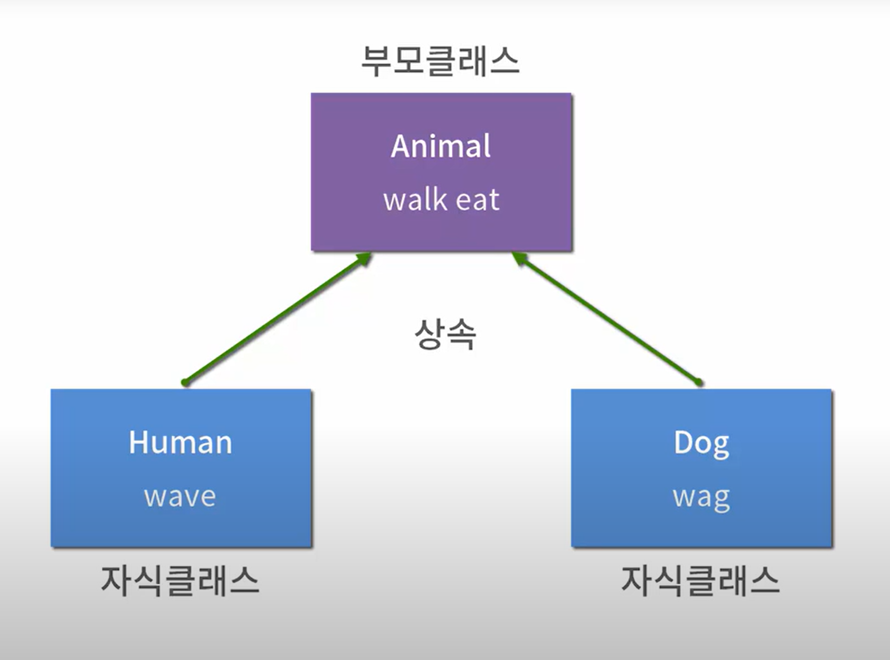
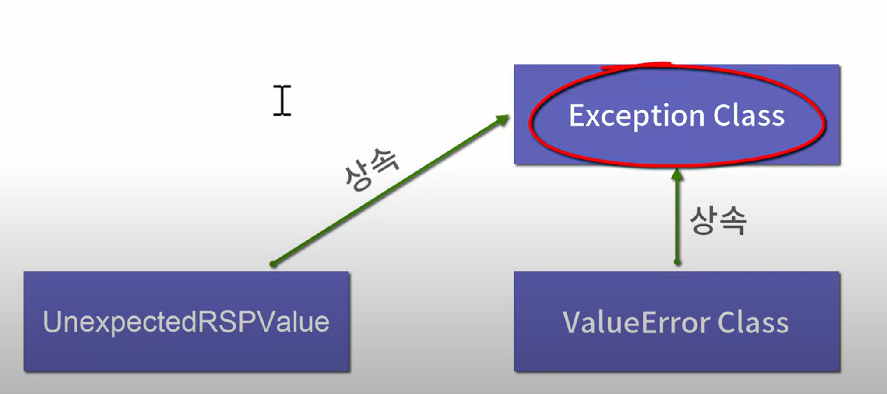

### 상속(Inheritance)

- 상속하는 클래스를 부모 클래스
- 상속받는 클래스를 자식 클래스
- 자식 클래스가 부모 클래스의 내용을 가져다 쓸 수 있는 것

```
class Animal():
    def walk(self):
        print("걷는다")

    def eat(self):
        print("먹는다")

class Human(Animal):
    def wave(self):
        print("손을 흔들다")
    
class Dog(Animal):
    def wag(self):
        print("꼬리를 흔들다")
```



<br><br>
### 오버라이드(override)
- 같은 이름을 가진 메소드를 덮어 쓴다는 의미

```
class Animal():
    def greet(self):
        print("인사한다")
    
class Human(Animal):
    def greet(self):
        print("손을 흔든다")
    
class Dog(Animal):
    def greet(self):
        print("꼬리를 흔든다")
```

### super()
- 자식 클래스에서 부모 클래스의 내용을 사용하고 싶은 경우
- super().부모클래스 내용

```
class Animal():
    def __init__(self, name):
        self.name = name

class Human(Animal):
    def __init__(self, name):
        super().__init__(name)    # 부모클래스의 __init__ 메소드 호출
        self.hand = hand

person = Human("사람", "오른손")
```

### 내 예외 만들기
#### 예외 정의
- 사용자가 직접 예외처리를 하면 코드의 직관성을 높일 수 있다.
- 파일을 하나 만들어 예외를 정의
- Exception클래스를 상속받아 만든다

<br>

```
try:
    sign_up()
except BadUserName:
    print("이름으로 사용할 수 없는 입력")
except PassworldNotMatched:
    print("입력한 패스워드 불일치")
```


- 에러의 최상위 클래스는 **Exception Class** 임


