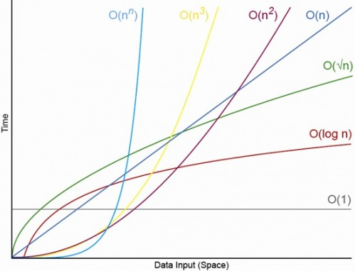

# 파이썬 시간복잡도 completion time

추가 일시: 2025년 8월 14일 오후 1:04
강의: 파이썬 몰랐던것들 정리

프로그래머스 문제를 풀다 보니 시간 초과되는 케이스가 발생해서 시간복잡도에 대한 개념공부가 필요해 보임.

**[Python] 파이썬 자료형 및 연산자의 시간 복잡도(Big-O) 총 정리**

[https://chancoding.tistory.com/43](https://chancoding.tistory.com/43)

# **시간 복잡도**

계산 복잡도 이론에서 **시간 복잡도**는 문제를 해결하는데 걸리는 시간과 입력의 함수 관계를 가리킨다. 컴퓨터과학에서 알고리즘의 시간 복잡도는 입력을 나타내는 문자열 길이의 함수로서 작동하는 알고리즘을 취해 시간을 정량화하는 것이다. 알고리즘의 시간복잡도는 주로 빅-오(Big-O)표기법을 사용하여 나타낸다. reference 위키백과

**시간복잡도 = 한마디로 시간이 얼마나 걸리느냐**

파이썬의 기본 산술 연산들은 `O(1)`으로 즉각적인 결과가 나타납니다.

길이가 `n`인 리스트를 처음부터 끝까지 요소를 하나씩 출력한다면, `print`함수를 `n`번 사용하므로 `O(1) x n`이므로 `O(n)`이라고 생각할 수 있습니다. 이중 for문은 `O(n²)`, 삼중 for문은 `O(n³)과` 같은 방식으로 진행됩니다.

- 복잡한 정도


`n`의 차수가 높아질수록 시간 복잡도가 올라가고 그만큼 시간이 오래 걸린다고 생각하면 됩니다. 전체적인 test case가 적으면 문제가 안됩니다. 하지만 `n`이 100,000 이상이나 가끔 백만 이상의 값들이 들어갈 경우 `n`의 차수에 따라서 걸리는 시간이 아주 급격하게 증가합니다.



---

# **자료형에 따른 시간 복잡도**

각 자료형과 해당 메서드, 연산자에 따른 시간 복잡도가 얼마나 되는지 알아보겠습니다. 각 자료형의 구성과 동작이 어떻게 돌아가는지 생각해보면 쉽게 시간 복잡도를 유추할 수 있습니다. 각 자료형이 어떻게 동작하는지 생각하면서 아래의 표를 보시면 쉽게 이해하실 수 있을 것입니다.

### **리스트 자료형과 메서드의 시간 복잡도**


### **딕셔너리(Dictionary) 자료형과 메소드의 시간 복잡도**


### **집합(set) 자료형과 메소드의 시간 복잡도**


# **자료형에 따른 시간 복잡도 비교**

메서드들의 시간 복잡도가 다르기 때문에 필요에 따라서 어떤 자료형을 사용하는 것이 좋은지 생각하면 더욱 좋은 알고리즘으로 파이썬 코드를 작성하실 수 있을 것입니다.

List 자료형은 **삽입, 제거, 탐색, 포함 여부 확인** 모두 `O(n)`에 해당하는 시간 복잡도를 가지고 있습니다.

Set과 Dictionary는 **삽입, 제거, 탐색, 포함여부확인** 연산에 `O(1)`의 시간 복잡도를 가지고 있습니다.

탐색과 확인이 주로 필요한 연산이라면 Set이나 Dictionary를 사용하는 것이 좋고 순서와 index에 따른 접근이 필요하다면 List 자료형을 사용하는 것이 좋을 것입니다.

---

얀에서는 매년 달리기 경주가 열립니다. 해설진들은 선수들이 자기 바로 앞의 선수를 추월할 때 추월한 선수의 이름을 부릅니다. 예를 들어 1등부터 3등까지 "mumu", "soe", "poe" 선수들이 순서대로 달리고 있을 때, 해설진이 "soe"선수를 불렀다면 2등인 "soe" 선수가 1등인 "mumu" 선수를 추월했다는 것입니다. 즉 "soe" 선수가 1등, "mumu" 선수가 2등으로 바뀝니다.

선수들의 이름이 1등부터 현재 등수 순서대로 담긴 문자열 배열 `players`와 해설진이 부른 이름을 담은 문자열 배열 `callings`가 매개변수로 주어질 때, 경주가 끝났을 때 선수들의 이름을 1등부터 등수 순서대로 배열에 담아 return 하는 solution 함수를 완성해주세요.

```python
def solution(players, callings):
    for i in callings:
        n = players.index(i)
        b = players[n]
        players[n] = players[n-1]
        players[n-1] = b
    return players
```


### **1. 문제 풀이 접근**

이 문제는 **해설진이 부른 선수(callings)가 추월**하면서 **players 리스트의 순서를 실시간으로 변경**해야 합니다.

즉, **선수의 현재 등수를 빠르게 찾고, 변경하는 것이 핵심**입니다.

- 선수들의 순위를 저장할 때 list.index()를 사용하면 시간복잡도가 O(N)으로 비효율적입니다.
- 해설진이 callings를 최대 1,000,000번 부를 수 있기 때문에, **O(N) 탐색을 반복하면 최악의 경우 O(N * M) = 50,000 * 1,000,000 = 50,000,000,000(500억 번 연산)이 되어 시간 초과가 발생합니다.**
- 따라서, **딕셔너리(해시맵)를 사용해 선수의 등수를 빠르게 조회하고 갱신**하는 것이 중요합니다.