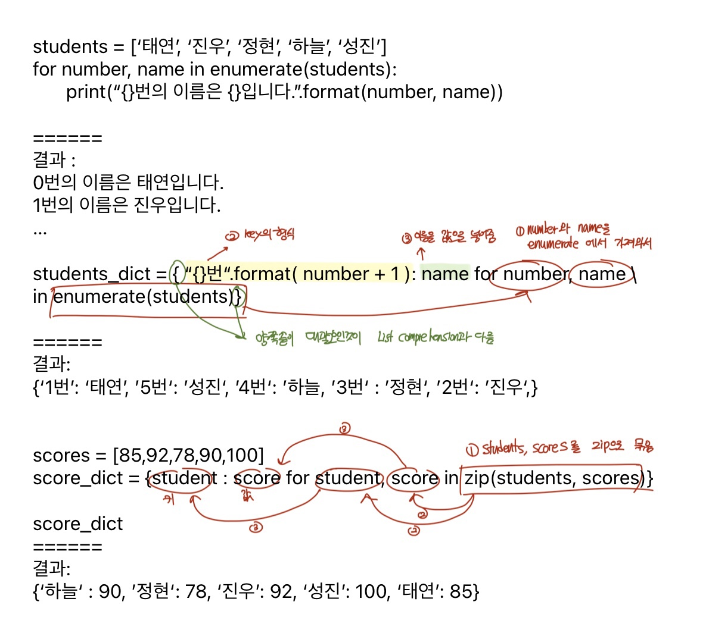
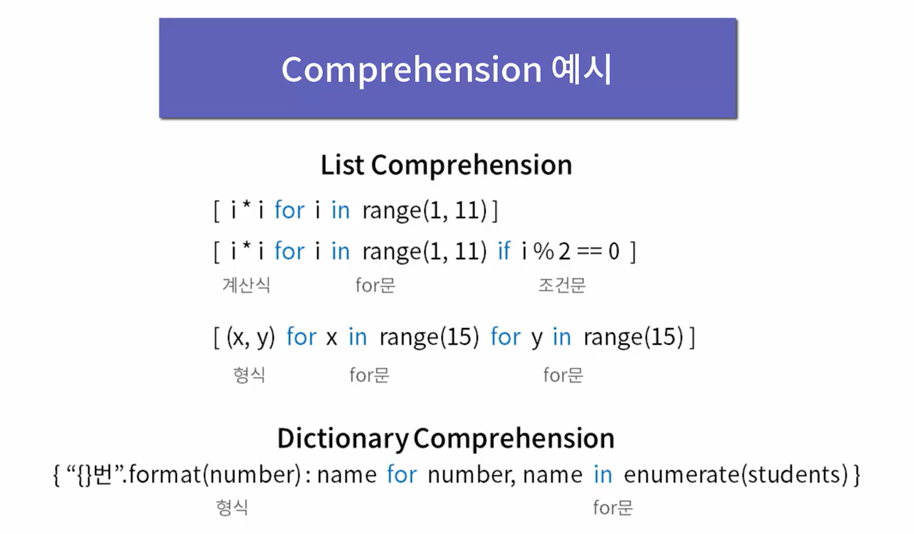

### List Comprehension
- 파이썬의 유용한 도구
  - 예1 `[ i*i for i in range(1,11)] # [ 계산식 for문 ]`
  - 예2 `[ i*i for i in range(1,11) if i % 2 == 0 ] # [ 계산식 for문 조건문]`
  - 예3 ` [ (x, y) for x in range(15) for y in range(15)] # [ 계산식 for 문 for 문 ]`

<br><br>

### Dictionary Comprehension

```
{ "{}번".format(number):name for number, name in enumerate(students) } # [ 형식 for문 ]
{student:score for student, score in zip(students, scores)}
```



