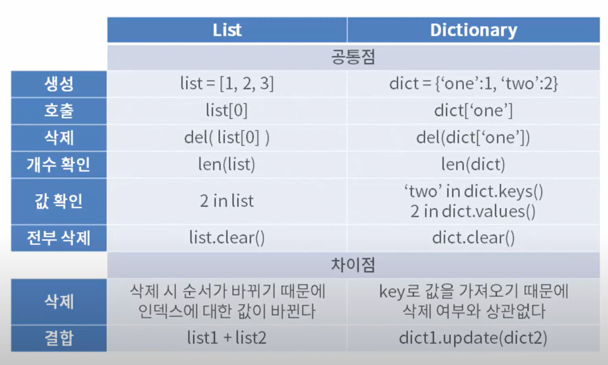

# 딕셔너리와 튜플

### 딕셔너리 수정하기

dict = {'one' : 1, 'two' : 2, 'three' : 3}

- 추가
  - dict['four'] = 4

- 수정
  - dict['one'] = 11

- 삭제
  - del(dict['one'])
  - dict.pop('two')
  
<br><br>
### 딕셔너리와 반복문

```
for key in ages.keys(): # key() 생략 가능
    print(key)
```

```
for value in ages.values():
    print(value)
```

- key와 value 둘 다 가져올 수 있음.
```
for key, value in ages.items():
    print('{}의 나이는 {}입니다.'.format(key, value))
```

- 딕셔너리는 값의 순서를 지키지 않는다.



<br><br>

### 튜플을 이용한 함수의 리턴값
- 튜플 리스트 활용
```
for a in enumerate(list):
    print('{}번째 값: {}'.format(a[0],a[1]))

for a in enumerate(list):
    print('{}번째 값: {}'.format(*a)) # 튜플을 쪼개라는 뜻
```

- 튜플 딕셔너리 활용
```
for a in dict.items():
    print('{}의 나이는 : {}.format(a[0], a[1]))

for a in dict.itmes():
    print('{}의 나이는 : {}.format(*a))
```