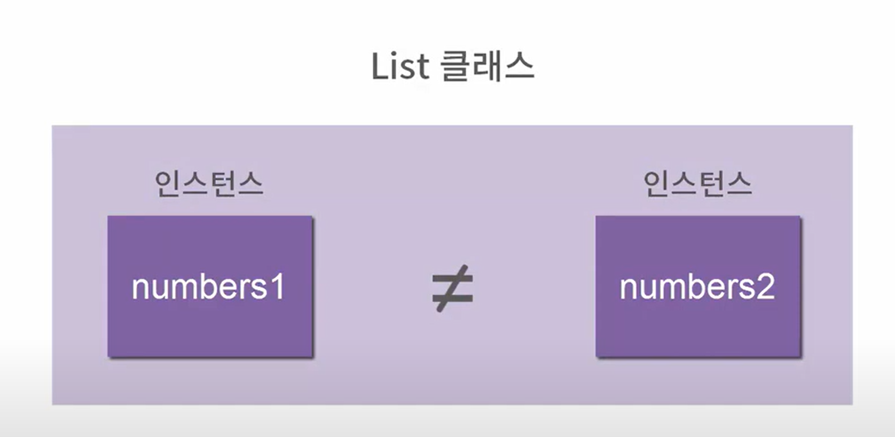

# 자료형 다루기

- isinstance(42, int)       # isinstance( 값, 자료형) : 자료형 검사

### 인스턴스 이해
#### 클래스
- 함수나 변수들을 모아놓은 집합체

#### 인스턴스
- 클래스에 의해 생성된 객체
- 인스턴스 각자 자신의 값을 가지고 있다.



<br><br>

### 클래스 만들기

#### 클래스 선언
```
class Human():  
    '''사람'''
```

#### 인스턴스 생성
```
person1 = Human()
person2 = Human()
```

- 클래스와 인스턴스를 사용하면 데이터와 코드를 사람이 이해하기 쉽게 포장할 수 있다.

### 메소드 이해하기

#### 메소드(Method)
- 메소드는 함수랑 비슷하다.
- 클래스에 묶어서 클래스의 인스턴스와 관계되는 일을 하는 함수

#### 클래스 내부에 함수를 포함시킨 예
```
class Human():
    '''인간'''
    def create(name, weight):
        person = Human()
        person.name = name
        person.weight = weight
        return person
    
    def eat(self):
        self.weight += 0.1
        print("{}가 먹어서 {}kg이 되었습니다.".format(self.name, self.weight))
    
    def walk(self):
        self.weight -= 0.1
        print("{}가 걸어서 {}이 되었습니다.".format(self.name, self.weight))

    def speak(self, message):
        print(message)

person = Human.create("석민", 75)
person.eat()
person.eat()
person.walk()
person.speak("Hi")
```

#### self
- 메소드의 첫번째 인자
- 인스턴스의 매개변수를 전달 할 때는 self 매개변수는 생략하고 전달

### 특수한 메소드
#### 초기화 함수

- `__init__` : 인스턴스를 만들 때 실행되는 함수

#### 문자열화 함수
- `__str__` : 인스턴스 자체를 출력 할 때의 형식을 지정해주는 함수

```
class Human():
    '''인간'''
    def __init__(self, name, weight):
        '''초기화 함수'''
        self.name = name
        self.weight = weight
    
    def __str__(self):
        '''문자열화 함수
        return "{} (몸무게 {}kg)".format(self.name, self.weight)

person = Human("사람", 60.5) # 초기화 함수 사용
print(person) # 문자열화 함수 사용
```